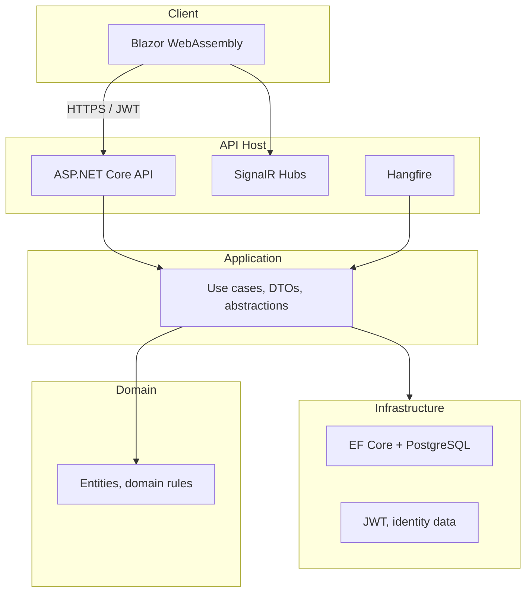

# HealthCareMS

Enterprise health-care management system built on **.NET 10** with a **Blazor WebAssembly** front end, **ASP.NET Core** REST API, and **PostgreSQL** persistence. The solution follows **clean architecture** (Domain, Application, Infrastructure) with **JWT** authentication, **SignalR** for real-time features, **Hangfire** for background jobs, and structured logging via **Serilog**.

---

## Table of contents

- [Capabilities](#capabilities)
- [Architecture](#architecture)
- [Technology stack](#technology-stack)
- [Prerequisites](#prerequisites)
- [Getting started](#getting-started)
- [Configuration](#configuration)
- [Running the applications](#running-the-applications)
- [Database migrations](#database-migrations)
- [API documentation](#api-documentation)
- [Testing](#testing)
- [Project structure](#project-structure)
- [Security and operations](#security-and-operations)
- [Additional documentation](#additional-documentation)

---

## Capabilities

| Area | Highlights |
|------|------------|
| **Identity and access** | Users, roles, permissions, permission middleware, JWT access and refresh flow, super-admin seeding |
| **Patients and doctors** | Registration, profiles, medical history, schedules, availability, verification |
| **Appointments and queue** | Book, confirm, cancel, reschedule, walk-in queue, slot conflict checks, real-time queue boards |
| **Consultations** | Diagnosis, ICD-10, prescriptions, e-prescription (PDF, QR, drug search, allergy checks), online video (Agora token API), waiting room, vitals and trends |
| **Collaboration** | Consultation chat with attachments (SignalR), read receipts |
| **Notifications** | Email (SMTP), SMS (Twilio), in-app (SignalR), scheduled reminders (Hangfire) |
| **Portals** | Doctor and patient dashboards; admin for appointments, doctors, and system configuration |
| **Pharmacy** | Medicine catalogue, stock batches (including FIFO), alerts, bulk import, barcode |
| **Labs** | Lab orders from consultation, consultation summary PDFs |

> Implementation status and verification notes: see [`IMPLEMENTATION_PROGRESS.md`](IMPLEMENTATION_PROGRESS.md) in the repository root.

---

## Architecture



- **API** composes the application and infrastructure, exposes REST endpoints, OpenAPI, health checks, SignalR, and Hangfire.
- **Blazor** consumes the API and real-time channels; CORS is configured for known development origins.
- **Application** holds orchestration; **Domain** remains persistence-agnostic; **Infrastructure** implements EF Core, auth, and external services.

---

## Technology stack

| Layer | Technologies |
|-------|----------------|
| Runtime | .NET 10 (C#), nullable reference types |
| API | ASP.NET Core, OpenAPI, JWT Bearer, Serilog, Hangfire (memory storage in default dev), health checks |
| Data | Entity Framework Core, PostgreSQL (Npgsql) |
| Client | Blazor WebAssembly, SignalR client |
| Cross-cutting | QuestPDF (documents), QRCoder, optional Twilio and SMTP |

---

## Prerequisites

- [.NET 10 SDK](https://dotnet.microsoft.com/download) (version aligned with the target frameworks in the `.csproj` files)
- [PostgreSQL](https://www.postgresql.org/) (local or remote instance)
- For full notification features: SMTP and/or [Twilio](https://www.twilio.com/) credentials (optional; disabled by default in `appsettings.json`)
- For video: Agora app credentials (see `Agora` section in configuration)

---

## Getting started

1. **Clone the repository** (or open the local workspace).

2. **Create the database** in PostgreSQL (e.g. database name `HealthCareMS`, or match your connection string).

3. **Set the connection string** in `src/HealthCareMS.API/appsettings.json` (or use user secrets / environment variables for non-committed values).

4. **Apply EF Core migrations** (see [Database migrations](#database-migrations)).

5. **Run the API and Blazor** projects (see [Running the applications](#running-the-applications)).

6. **Change default secrets** before any shared or production deployment: JWT signing key, super-admin password, and database credentials.

---

## Configuration

Key settings live under `src/HealthCareMS.API/appsettings.json` (use `appsettings.Development.json` or [User Secrets](https://learn.microsoft.com/en-us/aspnet/core/security/app-secrets) for local overrides):

| Section | Purpose |
|---------|---------|
| `ConnectionStrings:DefaultConnection` | PostgreSQL connection string |
| `Jwt` | Issuer, audience, signing key (minimum 32 characters for production), access token lifetime |
| `Database:ApplyMigrations` | Whether to apply migrations at startup (default `false`; prefer explicit `dotnet ef` in controlled environments) |
| `SuperAdmin` | Initial super-admin account (change password immediately) |
| `Notifications` | SMTP and Twilio toggles and endpoints |
| `Agora` | Video consultation token generation and client base URL |
| `Cors:AllowedOrigins` | Blazor and API URLs for browser clients |

> **Never** commit production secrets. Use environment variables, Azure Key Vault, or another secret store in real deployments.

---

## Running the applications

Default development URLs (from `launchSettings.json`):

| App | URL |
|-----|-----|
| **API (HTTP)** | `http://localhost:5270` |
| **API (HTTPS profile)** | `https://localhost:7254` and `http://localhost:5270` |
| **Blazor (HTTP)** | `http://localhost:5157` |
| **Blazor (HTTPS profile)** | `https://localhost:7279` and `http://localhost:5157` |

From the repository root:

```bash
# API
dotnet run --project src/HealthCareMS.API/HealthCareMS.API.csproj

# Blazor (separate terminal)
dotnet run --project src/HealthCareMS.Blazor/HealthCareMS.Blazor.csproj
```

**Smoke checks (examples):**

- API health-style probe: `GET /api/v1/system/ping` on the API base URL
- Hangfire dashboard (if enabled in development): `/hangfire` on the API host
- CORS: ensure Blazor origin is listed in `Cors:AllowedOrigins` so the browser client can call the API with credentials

---

## Database migrations

Migrations are maintained in the **Infrastructure** project; the **API** project is the startup project for tools.

```bash
dotnet ef database update --project src/HealthCareMS.Infrastructure/HealthCareMS.Infrastructure.csproj --startup-project src/HealthCareMS.API/HealthCareMS.API.csproj
```

Add the EF Core tools if needed:

```bash
dotnet tool install --global dotnet-ef
```

---

## API documentation

OpenAPI is enabled for the API project. In development, open the OpenAPI document via the app’s OpenAPI endpoint (as configured in `Program.cs` for your ASP.NET Core version) or use Swagger UI if you add the Swashbuckle or equivalent UI package.

---

## Testing

The solution includes unit and integration test projects under `tests/`:

```bash
dotnet test HealthCareMS.slnx --nologo
```

`IMPLEMENTATION_PROGRESS.md` records build/test verification history against the full solution.

---

## Project structure

```text
HealthCareMS.slnx
src/
  HealthCareMS.API/          # Web host, controllers, SignalR, Hangfire, logging
  HealthCareMS.Application/  # Application services, commands/queries
  HealthCareMS.Domain/       # Domain model
  HealthCareMS.Infrastructure/ # EF Core, external integrations
  HealthCareMS.Shared/        # Shared contracts and DTOs
  HealthCareMS.Blazor/        # Blazor WebAssembly client
tests/
  HealthCareMS.Tests.Unit/
  HealthCareMS.Tests.Integration/
```

---

## Security and operations

- Treat this system as **sensitive** by default: health data, authentication, and audit expectations depend on your deployment model and regional regulations (for example **HIPAA**, **GDPR**, or local health-data rules).
- Replace **all** default passwords and the JWT signing key before staging or production.
- Configure **TLS**, reverse proxies, and network isolation for production; restrict CORS to known front-end origins only.
- Enable and monitor **structured logs** (Serilog) and consider central log aggregation in production.
- For Hangfire, **memory storage** is suitable for local development; use a **persistent job store** (e.g. SQL Server or PostgreSQL storage) for production workloads.

---

## Additional documentation

| Resource | Description |
|----------|-------------|
| [`IMPLEMENTATION_PROGRESS.md`](IMPLEMENTATION_PROGRESS.md) | Feature completion and verification log |
| `docs/ImplementationReview.md` | Implementation review notes (if present) |

---

*HealthCareMS — built for modularity, auditability, and clear separation of concerns across API, application logic, and data access.*
